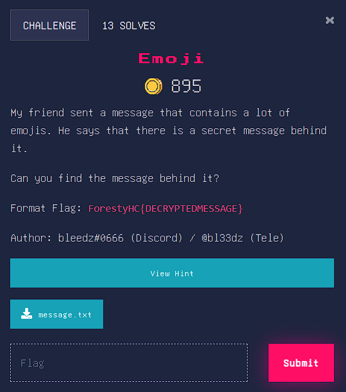
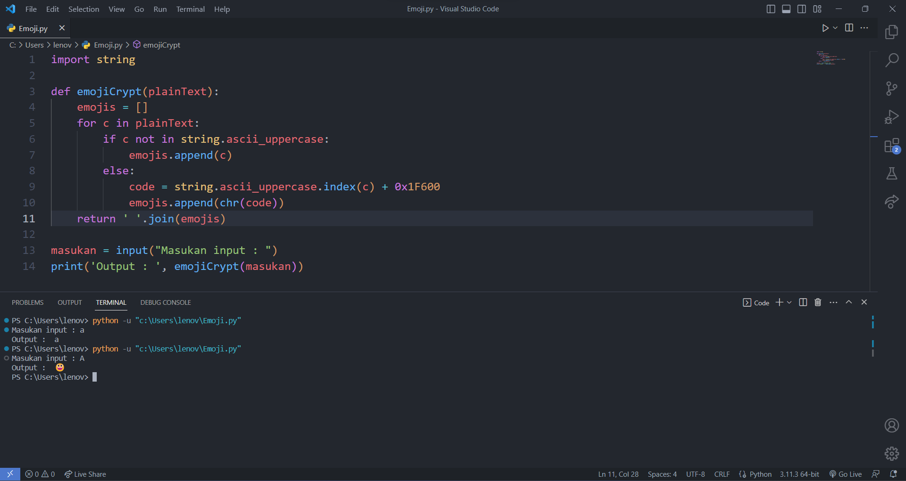
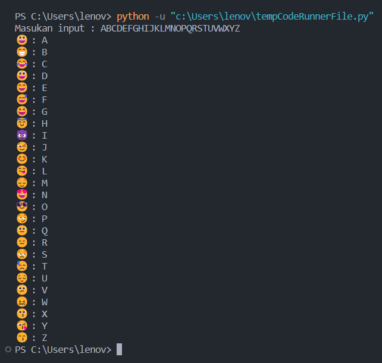

# Judul 1
Emoji

## About the Challenge
Diberikan sebuah file 'message.txt' 



## Solution
- Diberikan sebuah file 'message.txt'. Berikut adalah isi dari file tersebut : 
```
😈 😒 😓 😇 😈 😒 😑 😄 😀 😋 😋 😘 😂 😑 😘 😏 😓 😎 😂 😇 😀 😋 😋
```
- lalu diberikan juga hint berupa kode python yang sepertinya berfungsi untuk mengubah string menjadi emoji. Berikut kode python :
```py
import string

def emojiCrypt(plainText):
    emojis = []
    for c in plainText:
        if c not in string.ascii_uppercase:
            emojis.append(c)
        else:
            code = string.ascii_uppercase.index(c) + 0x1F600
            emojis.append(chr(code))
    return ' '.join(emojis)
```
- Selanjutnya saya mencoba menjalankan kode program tersebut ketika mencoba memasukan string_lowercase mengembalikan string itu sendiri.
- Selanjutnya saya mencoba memasukan string_uppercase dan outputnya berupa emoji.
 
- Selanjutnya saya memodifikasi kode program di atas agar dapat menampilkan tiap emoji untuk tiap karakter uppercase. Berikut ada kodenya : 
```py
import string

def emojiCrypt(plainText):
    uppercase = []
    for i in string.ascii_uppercase:
        uppercase.append(i)
    emojis = []
    for c in plainText:
        if c not in string.ascii_uppercase:
            emojis.append(c)
        else:
            code = string.ascii_uppercase.index(c) + 0x1F600
            emojis.append(chr(code))
    for i in range(0,26):
        print(emojis[i], ':', uppercase[i])

masukan = input("Masukan input : ")
emojiCrypt(masukan)ISTHISREALLYCRYPTOCHALL
```
- Berikut adalah output dari kode program di atas ketika di jalankan : 

- Selanjut dari output diatas saya mencoba mengdekripsi emoji yang diberikan oleh 'message.txt' secara manual dan didapat flagnya.

```
ISTHISREALLYCRYPTOCHALL
```
