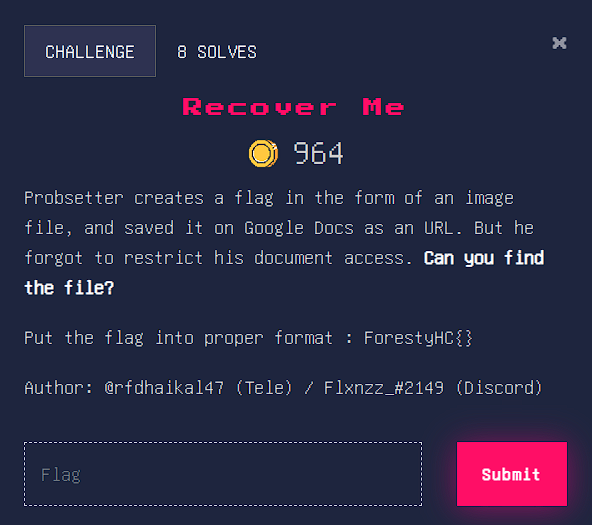
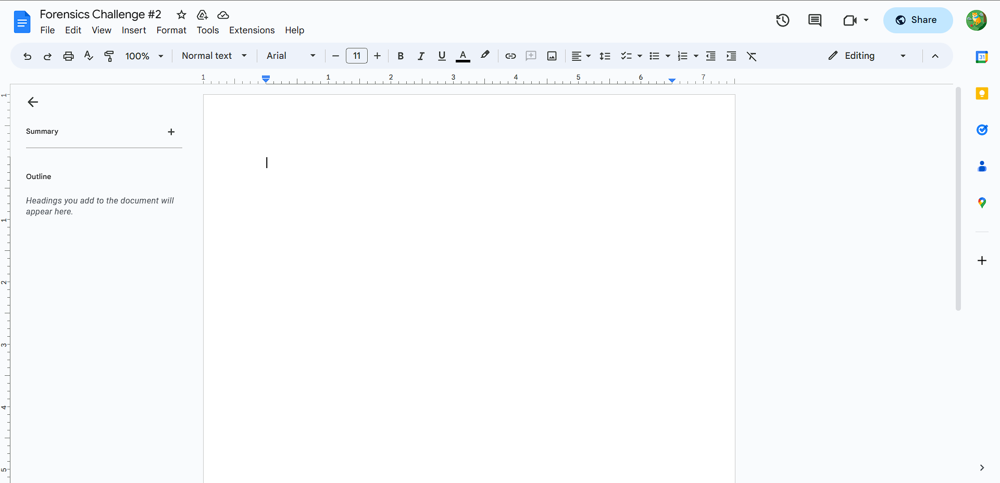
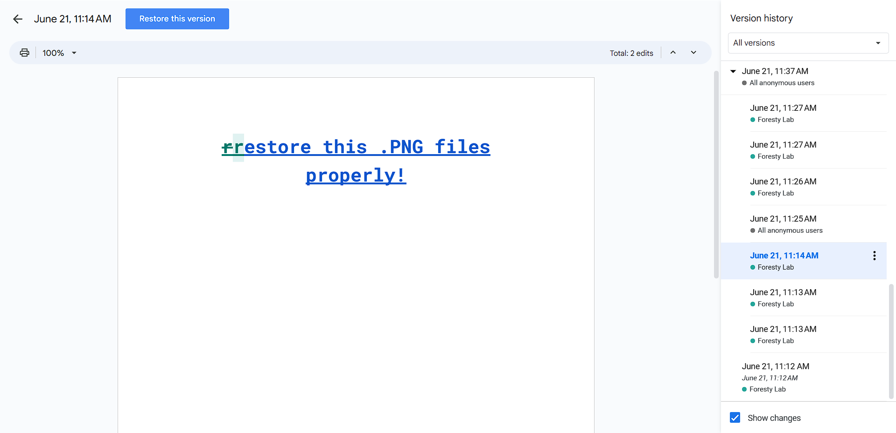
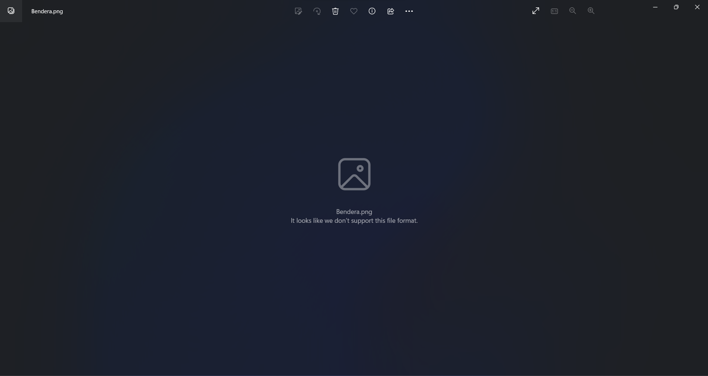
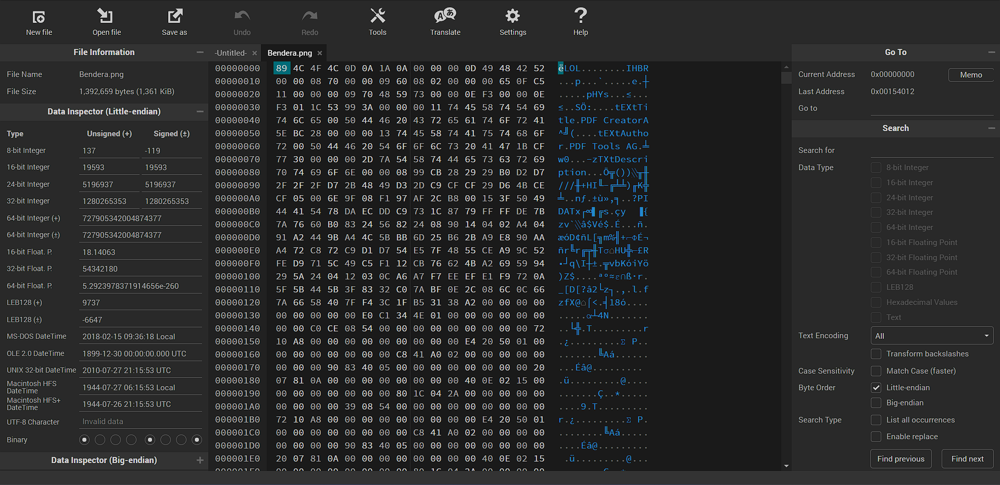
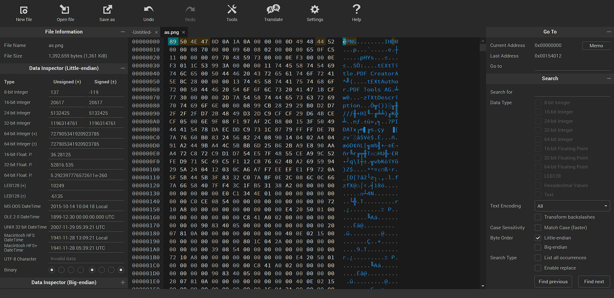
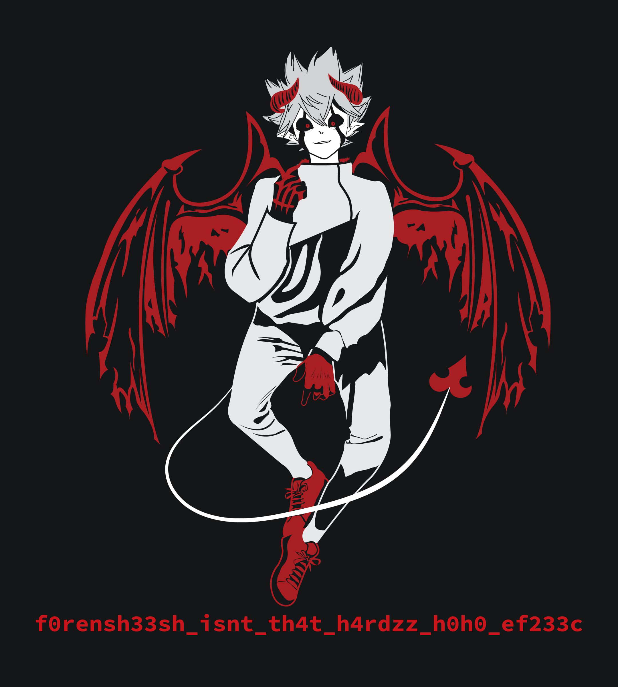

# Judul 1
Recover Me

## About the Challenge
Diberikan sebuah url menuju ke document (google docs) dimana user lupa mengubah akses document, sehingga orang yang membuka document tersebut dapat mengubah isi dari document tersebut.



## Solution
- Saya mencoba pergi ke url yang diberikan dan saat berada di sana isi dari document sudah kosong, mungkin telah dihapus oleh orang lain.

- Lalu saya mencoba melihat edit history dari document tersebut dan saya menemukan satu history yang berisi link untuk mendownload sebuah file image.

- Selanjut saya mendownload file image (Bendera.png) tersebut, hanya saja file tersebut tidak bisa dibuka (gambar tidak muncul)

- lalu saya mencoba melihat hex dari image ('Bendera.png') tersebut dengan menggunakan tools online. [url : https://hexed.it/]

- Karena file tersebut berekstensi .png maka saya mencoba mencari header dari png dan berikut adalah hasilnya : 

- Setelah itu saya mencocokan header hex png dengan header dari gambar 'Bendera.png'
- Ternyata ditemukan bahwa header file image 'Bendera.png' tidak sesuai dengan header png, maka dari itu saya mengubah header 'Bendera.png' menjadi sesuai dengan header png.

- Setelah berhasil diubah dan di export berikut adalah isi dari gambar ('Bendera.png) tersebut : 

- Flag berhasil ditemukan.

```
f0rensh33sh_isnt_th4t_h4rdzz_h0h0_ef233c
```
