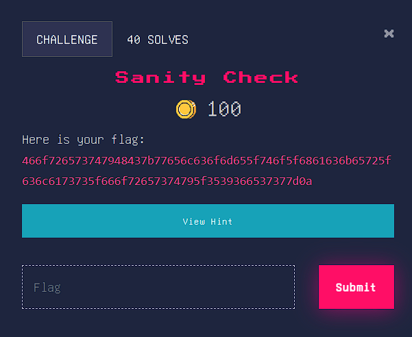
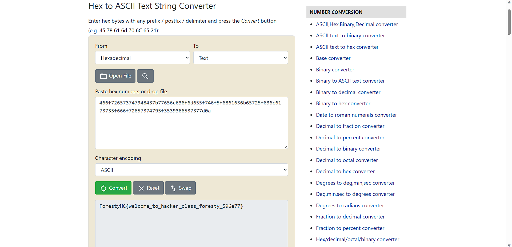

# Sanity Check
Here is your flag : 466f726573747948437b77656c636f6d655f746f5f6861636b65725f636c6173735f666f72657374795f3539366537377d0a

## About the Challenge
Diberikan sebuah flag yang kemungkinan telah di enkripsi :



## Solution
- Dilihat dari flag yang diberikan itu merupakan Hexa, sehingga disini saya akan mengenkripsi Hexa menjadi string/text dengan encoding ASCII.
- Tools yang digunakan : https://www.rapidtables.com/convert/number/hex-to-ascii.html



```
Flag Yang didapatkan : ForestyHC{welcome_to_hacker_class_foresty_596e77}
```
