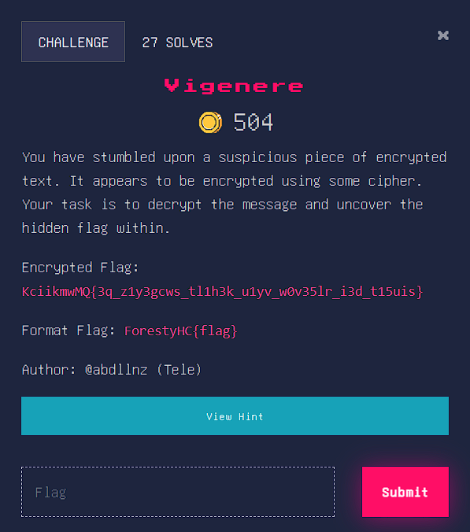
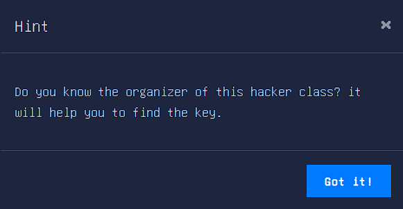
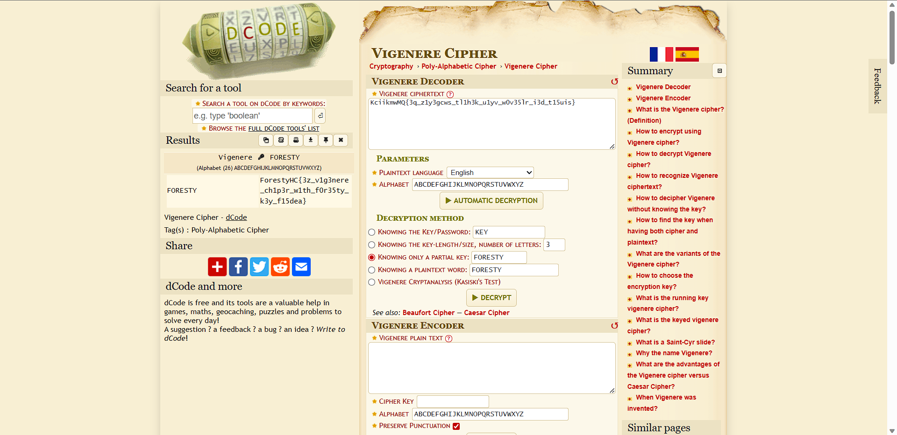

# Vigenere
You have stumbled upon a suspicious piece of encrypted text. It appears to be encrypted using some cipher. Your task is to decrypt the message and uncover the hidden flag within.

Encrypted Flag: KciikmwMQ{3q_z1y3gcws_tl1h3k_u1yv_w0v35lr_i3d_t15uis}

## About the Challenge
Diberikan sebuah encrypted flag dimana kita diminta untuk mecari tahu flag dari encrypted flag tersebut.



## Solution
- Dari encrypted permalahan sudah deberi clue bahwa flag tersebut terenkripsi dengan enkripsi vigenere, sehingga yang perlu dilakukan adalah menggunakan tool vigenere untuk mengenkripsi flag tersebut.
- Tool yang saya gunakan adalah Vigenere Chiper. [url : https://www.dcode.fr/vigenere-cipher]
- Terdapat bantuan bahwa oraganisasi pengola Hacker Class bisa membantu mendapatkan flag, maka dari itu saya menambahkan code : 'Foresty' pada key.


- Setelah melakukan Decrypt didapat Flag dari permasalahan tersebut.


```
Flag : ForestyHC{3z_v1g3nere_ch1p3r_w1th_f0r35ty_k3y_f15dea}
```
